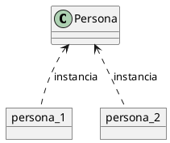
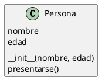
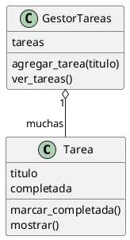
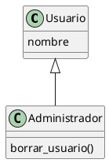
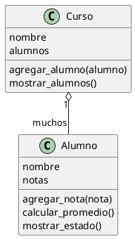

# 11c - Programacion orientada a objetos basica

## Objetivo

Entender los conceptos basicos de programacion orientada a objetos usando Python: clases, objetos, atributos, metodos, `__init__` y composicion simple entre objetos.

La programacion orientada a objetos, tambien llamada POO, es una forma de organizar codigo agrupando datos y comportamientos relacionados.

Hasta ahora representamos datos usando variables, listas y diccionarios. Por ejemplo, una tarea podia ser solo un texto:

```python
tarea = "Estudiar Python"
```

O un diccionario:

```python
tarea = {
    "titulo": "Estudiar Python",
    "completada": False
}
```

Con POO podemos crear un tipo propio llamado `Tarea`, que tenga sus datos y tambien acciones relacionadas.

## Clase y objeto

Una clase es un molde.

Un objeto es algo creado a partir de ese molde.

Ejemplo:

```python
class Persona:
    pass


persona_1 = Persona()
persona_2 = Persona()
```

`Persona` es la clase. `persona_1` y `persona_2` son objetos.

Diagrama:



## Atributos

Los atributos son datos que pertenecen a un objeto.

```python
class Persona:
    pass


persona = Persona()
persona.nombre = "Ana"
persona.edad = 22

print(persona.nombre)
print(persona.edad)
```

Aunque esto funciona, no es la forma mas ordenada. Lo recomendable es inicializar los atributos con `__init__`.

## `__init__`

`__init__` es un metodo especial que se ejecuta cuando se crea un objeto.

```python
class Persona:
    def __init__(self, nombre, edad):
        self.nombre = nombre
        self.edad = edad


persona = Persona("Ana", 22)

print(persona.nombre)
print(persona.edad)
```

`self` representa al objeto actual.

Cuando escribimos:

```python
self.nombre = nombre
```

Estamos guardando el valor recibido en un atributo del objeto.

## Metodos

Un metodo es una funcion que pertenece a una clase.

```python
class Persona:
    def __init__(self, nombre, edad):
        self.nombre = nombre
        self.edad = edad

    def presentarse(self):
        print(f"Hola, soy {self.nombre} y tengo {self.edad} anos")


persona = Persona("Ana", 22)
persona.presentarse()
```

Diagrama:



## Ejemplo con tareas

Podemos representar una tarea como clase.

```python
class Tarea:
    def __init__(self, titulo):
        self.titulo = titulo
        self.completada = False

    def marcar_completada(self):
        self.completada = True

    def mostrar(self):
        if self.completada:
            estado = "completada"
        else:
            estado = "pendiente"

        print(f"{self.titulo} - {estado}")


tarea = Tarea("Practicar funciones")
tarea.mostrar()
tarea.marcar_completada()
tarea.mostrar()
```

En este caso, la tarea no solo tiene datos. Tambien sabe hacer cosas:

- Guardar su titulo.
- Saber si esta completada.
- Marcarse como completada.
- Mostrarse en pantalla.

## Diferencia con diccionarios

Con diccionario:

```python
tarea = {
    "titulo": "Practicar funciones",
    "completada": False
}

tarea["completada"] = True
```

Con clase:

```python
tarea = Tarea("Practicar funciones")
tarea.marcar_completada()
```

El diccionario guarda datos. La clase puede guardar datos y tambien agrupar acciones relacionadas.

## Varios objetos

Una clase puede usarse para crear muchos objetos.

```python
tareas = [
    Tarea("Leer guia"),
    Tarea("Resolver ejercicios"),
    Tarea("Subir cambios")
]

for tarea in tareas:
    tarea.mostrar()
```

Cada objeto tiene sus propios atributos.

## Composicion

Composicion significa que un objeto contiene o usa otros objetos.

Por ejemplo, un gestor de tareas puede tener una lista de objetos `Tarea`.

```python
class GestorTareas:
    def __init__(self):
        self.tareas = []

    def agregar_tarea(self, titulo):
        nueva_tarea = Tarea(titulo)
        self.tareas.append(nueva_tarea)

    def ver_tareas(self):
        for tarea in self.tareas:
            tarea.mostrar()
```

Diagrama:



Este diseño ayuda a separar responsabilidades:

- `Tarea` representa una tarea individual.
- `GestorTareas` administra una coleccion de tareas.

## Encapsulamiento basico

Encapsular significa agrupar datos y comportamientos en una misma unidad.

No significa esconder todo, sino ordenar el acceso a los datos.

Ejemplo:

```python
class Producto:
    def __init__(self, nombre, precio, stock):
        self.nombre = nombre
        self.precio = precio
        self.stock = stock

    def vender(self, cantidad):
        if cantidad <= self.stock:
            self.stock = self.stock - cantidad
            print("Venta realizada")
        else:
            print("No hay stock suficiente")
```

La regla de stock queda dentro de la clase `Producto`. Asi evitamos repetir esa logica en muchas partes del programa.

## `__str__`

`__str__` es un metodo especial que define como se muestra un objeto como texto.

```python
class Producto:
    def __init__(self, nombre, precio):
        self.nombre = nombre
        self.precio = precio

    def __str__(self):
        return f"{self.nombre} - ${self.precio}"


producto = Producto("Mouse", 7500)
print(producto)
```

Sin `__str__`, Python muestra una representacion menos amigable del objeto.

## Herencia, solo como idea

La herencia permite crear una clase basada en otra.

No hace falta profundizar todavia, pero conviene reconocer el concepto.

```python
class Usuario:
    def __init__(self, nombre):
        self.nombre = nombre


class Administrador(Usuario):
    def borrar_usuario(self):
        print("Usuario borrado")
```

`Administrador` hereda de `Usuario`.

Diagrama:



Para empezar, es mas importante entender bien clases, objetos, atributos y metodos antes de usar mucha herencia.

## Cuando conviene usar clases

Conviene usar clases cuando:

- Hay entidades claras, como usuarios, productos, tareas, alumnos o turnos.
- Cada entidad tiene datos y acciones.
- El programa empieza a crecer y los diccionarios quedan incomodos.
- Queremos separar responsabilidades.

No siempre hace falta usar clases. Para programas pequenos, funciones y diccionarios pueden ser suficientes.

## Ejercicio

Crea un archivo llamado `alumno.py`.

Debe tener una clase `Alumno` con:

- `nombre`
- `notas`
- metodo `agregar_nota(nota)`
- metodo `calcular_promedio()`
- metodo `mostrar_estado()`

Reglas:

- Si el promedio es mayor o igual a 6, mostrar `Aprobado`.
- Si el promedio es menor a 6, mostrar `Desaprobado`.

## Desafio

Crea un pequeno sistema orientado a objetos para cursos.

Debe tener:

- Una clase `Alumno`.
- Una clase `Curso`.
- El curso debe tener una lista de alumnos.
- El curso debe permitir agregar alumnos.
- El curso debe mostrar todos los alumnos y sus promedios.

Diagrama sugerido:


