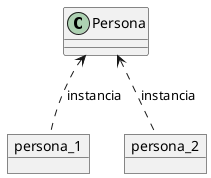
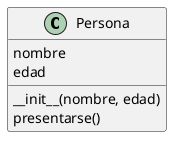
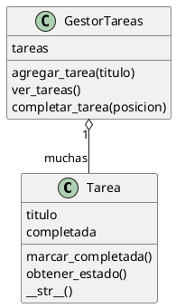
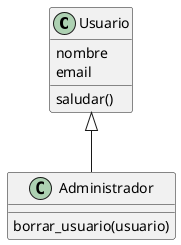
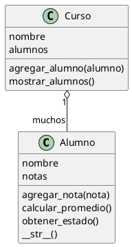

# 11c - Programacion orientada a objetos basica

## Objetivo

Entender los conceptos basicos de programacion orientada a objetos usando Python: clases, objetos, atributos, metodos, `__init__`, `__str__`, composicion, herencia y polimorfismo.

La programacion orientada a objetos, tambien llamada POO, es una forma de organizar codigo agrupando datos y comportamientos relacionados.

Hasta ahora representamos datos usando variables, listas y diccionarios. Por ejemplo, una tarea podia ser solo un texto:

```python
tarea = "Estudiar Python"
```

O un diccionario:

```python
tarea = {
    "titulo": "Estudiar Python",
    "completada": False
}
```

Con POO podemos crear un tipo propio llamado `Tarea`, que tenga sus datos y tambien acciones relacionadas.

```python
class Tarea:
    def __init__(self, titulo):
        self.titulo = titulo  # Dato propio de cada tarea.
        self.completada = False  # Toda tarea empieza pendiente.

    def marcar_completada(self):
        self.completada = True  # Cambia el estado interno del objeto.
```

La diferencia importante es que la clase no solo guarda informacion. Tambien define que operaciones tienen sentido para esa informacion.

## Por que usar POO

Al principio alcanza con listas, diccionarios y funciones. Pero cuando un programa crece, suelen aparecer problemas:

- La misma logica se repite en varios lugares.
- Los diccionarios tienen muchas claves y es facil escribir una mal.
- No queda claro que datos y que funciones pertenecen al mismo concepto.
- Cambiar una regla obliga a revisar muchas partes del codigo.

La POO ayuda a ordenar ese crecimiento. No hace que el programa sea automaticamente mejor, pero permite representar entidades del problema de una forma mas clara.

Ejemplos de entidades:

- Una `Persona` tiene nombre y edad, y puede presentarse.
- Una `Tarea` tiene titulo y estado, y puede completarse.
- Un `Producto` tiene precio y stock, y puede venderse.
- Un `Alumno` tiene notas, y puede calcular su promedio.
- Un `Curso` tiene alumnos, y puede mostrarlos.

## Clase y objeto

Una clase es un molde.

Un objeto es algo creado a partir de ese molde.

```python
class Persona:
    pass  # La clase existe, pero todavia no tiene atributos ni metodos.


persona_1 = Persona()  # Creamos un objeto de la clase Persona.
persona_2 = Persona()  # Creamos otro objeto independiente.
```

`Persona` es la clase. `persona_1` y `persona_2` son objetos.

Tambien se dice que `persona_1` y `persona_2` son instancias de `Persona`.

Diagrama:



## Atributos

Los atributos son datos que pertenecen a un objeto.

```python
class Persona:
    pass


persona = Persona()  # Creamos una persona vacia.
persona.nombre = "Ana"  # Agregamos el atributo nombre.
persona.edad = 22  # Agregamos el atributo edad.

print(persona.nombre)  # Muestra Ana.
print(persona.edad)  # Muestra 22.
```

Aunque esto funciona, no es la forma mas ordenada. El problema es que cada objeto podria terminar con atributos distintos.

```python
persona_1 = Persona()
persona_1.nombre = "Ana"

persona_2 = Persona()
persona_2.edad = 30
```

En ese ejemplo, `persona_1` tiene `nombre` pero no tiene `edad`, y `persona_2` tiene `edad` pero no tiene `nombre`. Eso puede generar errores dificiles de seguir.

Lo recomendable es inicializar los atributos con `__init__`.

## `__init__`

`__init__` es un metodo especial que se ejecuta automaticamente cuando se crea un objeto.

```python
class Persona:
    def __init__(self, nombre, edad):
        self.nombre = nombre  # Guardamos el nombre recibido en el objeto.
        self.edad = edad  # Guardamos la edad recibida en el objeto.


persona = Persona("Ana", 22)  # Python llama a __init__ por nosotros.

print(persona.nombre)  # Ana
print(persona.edad)  # 22
```

`self` representa al objeto actual.

Cuando escribimos:

```python
self.nombre = nombre
```

Estamos diciendo:

- `self.nombre`: atributo que queda guardado dentro del objeto.
- `nombre`: parametro recibido por el metodo `__init__`.

El nombre del parametro podria ser distinto, pero normalmente se usa el mismo nombre porque es claro.

```python
class Persona:
    def __init__(self, nombre_recibido, edad_recibida):
        self.nombre = nombre_recibido  # El atributo se llama nombre.
        self.edad = edad_recibida  # El atributo se llama edad.
```

## Metodos

Un metodo es una funcion que pertenece a una clase.

```python
class Persona:
    def __init__(self, nombre, edad):
        self.nombre = nombre  # Atributo del objeto.
        self.edad = edad  # Atributo del objeto.

    def presentarse(self):
        print(f"Hola, soy {self.nombre} y tengo {self.edad} anos")  # Usa datos del objeto.


persona = Persona("Ana", 22)
persona.presentarse()  # Llamamos al metodo del objeto.
```

Los metodos permiten ubicar la logica cerca de los datos que usa.

Diagrama:



## Atributos de instancia

Los atributos que se guardan con `self` son atributos de instancia. Esto significa que cada objeto tiene su propia copia.

```python
class Persona:
    def __init__(self, nombre, edad):
        self.nombre = nombre  # Cada persona tiene su propio nombre.
        self.edad = edad  # Cada persona tiene su propia edad.


ana = Persona("Ana", 22)
luis = Persona("Luis", 30)

print(ana.nombre)  # Ana
print(luis.nombre)  # Luis
```

Cambiar un objeto no cambia automaticamente el otro.

```python
ana.edad = 23  # Modificamos solo la edad de ana.

print(ana.edad)  # 23
print(luis.edad)  # 30
```

## Ejemplo completo: tarea

Podemos representar una tarea como clase.

```python
class Tarea:
    def __init__(self, titulo):
        self.titulo = titulo  # Texto que describe la tarea.
        self.completada = False  # Estado inicial de la tarea.

    def marcar_completada(self):
        self.completada = True  # Cambiamos el estado a completada.

    def mostrar(self):
        if self.completada:
            estado = "completada"  # Texto para tareas terminadas.
        else:
            estado = "pendiente"  # Texto para tareas no terminadas.

        print(f"{self.titulo} - {estado}")  # Mostramos la tarea en pantalla.


tarea = Tarea("Practicar funciones")  # Creamos una tarea.
tarea.mostrar()  # Practicar funciones - pendiente

tarea.marcar_completada()  # Cambiamos su estado.
tarea.mostrar()  # Practicar funciones - completada
```

En este caso, la tarea no solo tiene datos. Tambien sabe hacer cosas:

- Guardar su titulo.
- Saber si esta completada.
- Marcarse como completada.
- Mostrarse en pantalla.

## Diferencia con diccionarios

Con diccionario:

```python
tarea = {
    "titulo": "Practicar funciones",
    "completada": False
}

tarea["completada"] = True  # Cambiamos una clave del diccionario.
```

Con clase:

```python
tarea = Tarea("Practicar funciones")
tarea.marcar_completada()  # La accion tiene un nombre claro.
```

El diccionario guarda datos. La clase puede guardar datos y tambien agrupar acciones relacionadas.

Esto no significa que las clases reemplacen siempre a los diccionarios. Si solo necesitamos guardar datos simples, un diccionario puede estar bien. Si esos datos tienen reglas y acciones propias, una clase suele ser mas clara.

## Varios objetos

Una clase puede usarse para crear muchos objetos.

```python
tareas = [
    Tarea("Leer guia"),  # Primer objeto Tarea.
    Tarea("Resolver ejercicios"),  # Segundo objeto Tarea.
    Tarea("Subir cambios")  # Tercer objeto Tarea.
]

for tarea in tareas:
    tarea.mostrar()  # Cada objeto ejecuta su propio metodo.
```

Cada objeto tiene sus propios atributos.

```python
tareas[0].marcar_completada()  # Solo completamos la primera tarea.

for tarea in tareas:
    tarea.mostrar()
```

## `__str__`

`__str__` es un metodo especial que define como se muestra un objeto como texto.

```python
class Producto:
    def __init__(self, nombre, precio):
        self.nombre = nombre  # Nombre del producto.
        self.precio = precio  # Precio del producto.

    def __str__(self):
        return f"{self.nombre} - ${self.precio}"  # Texto amigable del objeto.


producto = Producto("Mouse", 7500)
print(producto)  # Python usa __str__ automaticamente.
```

Sin `__str__`, Python muestra una representacion menos amigable del objeto, por ejemplo algo parecido a:

```text
<__main__.Producto object at 0x...>
```

`__str__` no deberia imprimir directamente. Debe devolver un texto con `return`.

## Encapsulamiento basico

Encapsular significa agrupar datos y comportamientos en una misma unidad.

No significa esconder todo, sino ordenar el acceso a los datos.

Ejemplo:

```python
class Producto:
    def __init__(self, nombre, precio, stock):
        self.nombre = nombre  # Dato del producto.
        self.precio = precio  # Precio unitario.
        self.stock = stock  # Cantidad disponible.

    def vender(self, cantidad):
        if cantidad <= self.stock:
            self.stock = self.stock - cantidad  # Actualizamos el stock dentro de la clase.
            print("Venta realizada")
        else:
            print("No hay stock suficiente")  # La regla tambien queda dentro de la clase.

    def __str__(self):
        return f"{self.nombre} - ${self.precio} - Stock: {self.stock}"


producto = Producto("Mouse", 7500, 10)

print(producto)  # Mouse - $7500 - Stock: 10
producto.vender(3)  # Venta realizada
print(producto)  # Mouse - $7500 - Stock: 7
producto.vender(20)  # No hay stock suficiente
```

La regla de stock queda dentro de la clase `Producto`. Asi evitamos repetir esa logica en muchas partes del programa.

## Composicion

Composicion significa que un objeto contiene o usa otros objetos.

Por ejemplo, un gestor de tareas puede tener una lista de objetos `Tarea`.

```python
class Tarea:
    def __init__(self, titulo):
        self.titulo = titulo  # Titulo de la tarea.
        self.completada = False  # Estado inicial.

    def marcar_completada(self):
        self.completada = True  # Modificamos el estado.

    def obtener_estado(self):
        if self.completada:
            return "completada"  # Devolvemos texto para estado verdadero.

        return "pendiente"  # Devolvemos texto para estado falso.

    def __str__(self):
        return f"{self.titulo} - {self.obtener_estado()}"  # Reutilizamos obtener_estado.


class GestorTareas:
    def __init__(self):
        self.tareas = []  # El gestor contiene muchas tareas.

    def agregar_tarea(self, titulo):
        nueva_tarea = Tarea(titulo)  # Creamos un objeto Tarea.
        self.tareas.append(nueva_tarea)  # Guardamos el objeto en la lista.

    def ver_tareas(self):
        if len(self.tareas) == 0:
            print("No hay tareas")
        else:
            for indice, tarea in enumerate(self.tareas, start=1):
                print(f"{indice}. {tarea}")  # __str__ convierte la tarea a texto.

    def completar_tarea(self, posicion):
        indice = posicion - 1  # El usuario cuenta desde 1, la lista cuenta desde 0.

        if indice >= 0 and indice < len(self.tareas):
            self.tareas[indice].marcar_completada()  # Pedimos a la tarea que se complete.
            print("Tarea completada")
        else:
            print("Numero de tarea invalido")


gestor = GestorTareas()

gestor.agregar_tarea("Leer guia de POO")
gestor.agregar_tarea("Practicar clases")
gestor.ver_tareas()

gestor.completar_tarea(1)
gestor.ver_tareas()
```

Diagrama:



Este diseno ayuda a separar responsabilidades:

- `Tarea` representa una tarea individual.
- `GestorTareas` administra una coleccion de tareas.

## Herencia

La herencia permite crear una clase nueva basada en otra clase existente.

La clase original se llama clase padre, clase base o superclase.

La clase nueva se llama clase hija, clase derivada o subclase.

La idea principal es reutilizar atributos y metodos comunes.

Ejemplo:

```python
class Usuario:
    def __init__(self, nombre, email):
        self.nombre = nombre  # Atributo comun para todos los usuarios.
        self.email = email  # Atributo comun para todos los usuarios.

    def saludar(self):
        print(f"Hola, soy {self.nombre}")  # Metodo comun.


class Administrador(Usuario):
    def borrar_usuario(self, usuario):
        print(f"{self.nombre} borro al usuario {usuario}")  # Metodo propio del administrador.


admin = Administrador("Ana", "ana@empresa.com")

admin.saludar()  # Metodo heredado desde Usuario.
admin.borrar_usuario("Luis")  # Metodo propio de Administrador.
print(admin.email)  # Atributo heredado desde Usuario.
```

`Administrador` hereda de `Usuario`. Por eso puede usar `saludar`, `nombre` y `email`, aunque esos elementos fueron definidos en `Usuario`.

Diagrama:



## `super()`

Cuando una clase hija necesita agregar atributos propios, puede llamar al constructor de la clase padre usando `super()`.

```python
class Usuario:
    def __init__(self, nombre, email):
        self.nombre = nombre  # Atributo comun.
        self.email = email  # Atributo comun.

    def mostrar_datos(self):
        print(f"{self.nombre} - {self.email}")  # Metodo comun.


class Administrador(Usuario):
    def __init__(self, nombre, email, area):
        super().__init__(nombre, email)  # Reutilizamos la inicializacion de Usuario.
        self.area = area  # Agregamos un atributo propio de Administrador.

    def mostrar_area(self):
        print(f"Area: {self.area}")  # Metodo propio de Administrador.


admin = Administrador("Ana", "ana@empresa.com", "Sistemas")

admin.mostrar_datos()  # Metodo heredado.
admin.mostrar_area()  # Metodo propio.
```

`super().__init__(nombre, email)` evita repetir en `Administrador` las asignaciones que ya existen en `Usuario`.

## Sobrescritura de metodos

Una clase hija puede redefinir un metodo heredado. A esto se lo llama sobrescritura.

```python
class Usuario:
    def __init__(self, nombre):
        self.nombre = nombre  # Nombre comun.

    def obtener_permiso(self):
        return "permiso basico"  # Comportamiento general.


class Administrador(Usuario):
    def obtener_permiso(self):
        return "permiso total"  # Comportamiento especifico para administradores.


usuario = Usuario("Luis")
admin = Administrador("Ana")

print(usuario.obtener_permiso())  # permiso basico
print(admin.obtener_permiso())  # permiso total
```

La clase hija conserva lo que le sirve de la clase padre, pero puede cambiar lo que necesita comportarse distinto.

## Polimorfismo

Polimorfismo significa "muchas formas".

En programacion, significa que distintos objetos pueden responder al mismo metodo, cada uno a su manera.

Ejemplo:

```python
class Perro:
    def hacer_sonido(self):
        print("Guau")  # Implementacion propia de Perro.


class Gato:
    def hacer_sonido(self):
        print("Miau")  # Implementacion propia de Gato.


animales = [Perro(), Gato()]

for animal in animales:
    animal.hacer_sonido()  # Mismo mensaje, distinto comportamiento.
```

El bucle no necesita preguntar si el objeto es un `Perro` o un `Gato`. Solo necesita saber que puede llamar a `hacer_sonido()`.

En Python esto es muy natural. Si un objeto tiene el metodo que queremos usar, podemos usarlo.

## Polimorfismo con herencia

El polimorfismo tambien suele aparecer junto con herencia.

```python
class Notificacion:
    def __init__(self, destinatario, mensaje):
        self.destinatario = destinatario  # Persona o direccion que recibe el mensaje.
        self.mensaje = mensaje  # Contenido de la notificacion.

    def enviar(self):
        print("Enviando notificacion generica")  # Comportamiento base.


class NotificacionEmail(Notificacion):
    def enviar(self):
        print(f"Email para {self.destinatario}: {self.mensaje}")  # Forma email.


class NotificacionSMS(Notificacion):
    def enviar(self):
        print(f"SMS para {self.destinatario}: {self.mensaje}")  # Forma SMS.


class NotificacionApp(Notificacion):
    def enviar(self):
        print(f"App para {self.destinatario}: {self.mensaje}")  # Forma app.


notificaciones = [
    NotificacionEmail("ana@empresa.com", "Tu pedido fue enviado"),
    NotificacionSMS("1133445566", "Codigo de acceso: 1234"),
    NotificacionApp("usuario_25", "Tenes una nueva tarea")
]

for notificacion in notificaciones:
    notificacion.enviar()  # Todas entienden enviar, pero cada clase lo resuelve distinto.
```

La ventaja es que el codigo que recorre la lista no cambia cuando agregamos un nuevo tipo de notificacion. Si manana agregamos `NotificacionWhatsApp`, solo necesitamos crear una nueva clase con su propio metodo `enviar()`.

## Herencia o composicion

Herencia sirve para expresar una relacion "es un".

- Un `Administrador` es un `Usuario`.
- Una `NotificacionEmail` es una `Notificacion`.
- Un `AlumnoBecado` podria ser un `Alumno`.

Composicion sirve para expresar una relacion "tiene".

- Un `Curso` tiene alumnos.
- Un `GestorTareas` tiene tareas.
- Un `Pedido` tiene productos.

No conviene usar herencia solo para reutilizar codigo. Si la relacion no es claramente "es un", probablemente convenga composicion.

## Ejemplo completo: alumnos y curso

Este ejemplo combina clases, metodos, `__str__` y composicion.

```python
class Alumno:
    def __init__(self, nombre):
        self.nombre = nombre  # Nombre del alumno.
        self.notas = []  # Lista de notas del alumno.

    def agregar_nota(self, nota):
        self.notas.append(nota)  # Agregamos una nota a la lista.

    def calcular_promedio(self):
        if len(self.notas) == 0:
            return 0  # Si no hay notas, evitamos dividir por cero.

        return sum(self.notas) / len(self.notas)  # Promedio = suma / cantidad.

    def obtener_estado(self):
        if self.calcular_promedio() >= 6:
            return "Aprobado"  # Regla de aprobacion.

        return "Desaprobado"  # Regla de desaprobacion.

    def __str__(self):
        promedio = self.calcular_promedio()  # Calculamos el promedio una vez.
        estado = self.obtener_estado()  # Obtenemos el estado segun el promedio.

        return f"{self.nombre} - Promedio: {promedio} - {estado}"


class Curso:
    def __init__(self, nombre):
        self.nombre = nombre  # Nombre del curso.
        self.alumnos = []  # El curso contiene alumnos.

    def agregar_alumno(self, alumno):
        self.alumnos.append(alumno)  # Guardamos un objeto Alumno.

    def mostrar_alumnos(self):
        print(f"Curso: {self.nombre}")

        for alumno in self.alumnos:
            print(alumno)  # Python usa Alumno.__str__.


curso = Curso("Python inicial")

ana = Alumno("Ana")
ana.agregar_nota(8)
ana.agregar_nota(9)

luis = Alumno("Luis")
luis.agregar_nota(4)
luis.agregar_nota(7)

curso.agregar_alumno(ana)
curso.agregar_alumno(luis)
curso.mostrar_alumnos()
```

Salida esperada:

```text
Curso: Python inicial
Ana - Promedio: 8.5 - Aprobado
Luis - Promedio: 5.5 - Desaprobado
```

## Ejemplo completo: herencia y polimorfismo con alumnos

Supongamos que algunos alumnos tienen una condicion especial. Un alumno comun aprueba con 6, pero un alumno becado necesita promedio 8 para conservar la beca.

```python
class Alumno:
    def __init__(self, nombre):
        self.nombre = nombre  # Nombre del alumno.
        self.notas = []  # Notas cargadas.

    def agregar_nota(self, nota):
        self.notas.append(nota)  # Agregamos una nota.

    def calcular_promedio(self):
        if len(self.notas) == 0:
            return 0  # Evitamos dividir por cero.

        return sum(self.notas) / len(self.notas)  # Calculamos promedio.

    def obtener_estado(self):
        if self.calcular_promedio() >= 6:
            return "Aprobado"  # Regla general.

        return "Desaprobado"

    def __str__(self):
        return f"{self.nombre} - Promedio: {self.calcular_promedio()} - {self.obtener_estado()}"


class AlumnoBecado(Alumno):
    def __init__(self, nombre, beca):
        super().__init__(nombre)  # Inicializamos nombre y notas usando Alumno.
        self.beca = beca  # Atributo propio del alumno becado.

    def obtener_estado(self):
        if self.calcular_promedio() >= 8:
            return f"Beca {self.beca} conservada"  # Regla especifica.

        return f"Beca {self.beca} en riesgo"  # Regla especifica.


alumnos = [
    Alumno("Ana"),
    AlumnoBecado("Sofia", "Programacion")
]

alumnos[0].agregar_nota(7)
alumnos[0].agregar_nota(8)

alumnos[1].agregar_nota(7)
alumnos[1].agregar_nota(8)

for alumno in alumnos:
    print(alumno)  # Mismo __str__, pero obtener_estado se resuelve segun la clase real.
```

Salida esperada:

```text
Ana - Promedio: 7.5 - Aprobado
Sofia - Promedio: 7.5 - Beca Programacion en riesgo
```

Este ejemplo muestra dos ideas al mismo tiempo:

- Herencia: `AlumnoBecado` hereda atributos y metodos de `Alumno`.
- Polimorfismo: ambos objetos responden a `obtener_estado()`, pero cada clase aplica una regla distinta.

## Cuando conviene usar clases

Conviene usar clases cuando:

- Hay entidades claras, como usuarios, productos, tareas, alumnos o turnos.
- Cada entidad tiene datos y acciones.
- El programa empieza a crecer y los diccionarios quedan incomodos.
- Queremos separar responsabilidades.
- Queremos expresar relaciones como "tiene" o "es un".

No siempre hace falta usar clases. Para programas pequenos, funciones y diccionarios pueden ser suficientes.

## Errores comunes

### Olvidar `self`

```python
class Persona:
    def __init__(nombre, edad):
        nombre = nombre  # Incorrecto: falta self.
        edad = edad  # Incorrecto: no se guardan atributos en el objeto.
```

Version correcta:

```python
class Persona:
    def __init__(self, nombre, edad):
        self.nombre = nombre  # Correcto: queda guardado en el objeto.
        self.edad = edad  # Correcto: queda guardado en el objeto.
```

### Llamar un metodo sin parentesis

```python
tarea.marcar_completada  # Incorrecto: solo referencia el metodo.
tarea.marcar_completada()  # Correcto: ejecuta el metodo.
```

### Usar herencia cuando corresponde composicion

```python
class Curso(Alumno):
    pass  # Incorrecto conceptualmente: un curso no es un alumno.
```

Mejor:

```python
class Curso:
    def __init__(self):
        self.alumnos = []  # Correcto: un curso tiene alumnos.
```

## Ejercicio resuelto 1: alumno

Crea un archivo llamado `alumno.py`.

Debe tener una clase `Alumno` con:

- `nombre`
- `notas`
- metodo `agregar_nota(nota)`
- metodo `calcular_promedio()`
- metodo `mostrar_estado()`

Reglas:

- Si el promedio es mayor o igual a 6, mostrar `Aprobado`.
- Si el promedio es menor a 6, mostrar `Desaprobado`.

Resolucion:

```python
class Alumno:
    def __init__(self, nombre):
        self.nombre = nombre  # Guardamos el nombre del alumno.
        self.notas = []  # Creamos una lista vacia para sus notas.

    def agregar_nota(self, nota):
        self.notas.append(nota)  # Sumamos una nota nueva a la lista.

    def calcular_promedio(self):
        if len(self.notas) == 0:
            return 0  # Si no hay notas, el promedio se considera 0.

        return sum(self.notas) / len(self.notas)  # Calculamos el promedio real.

    def mostrar_estado(self):
        promedio = self.calcular_promedio()  # Reutilizamos el metodo de promedio.

        if promedio >= 6:
            estado = "Aprobado"  # Estado para promedio suficiente.
        else:
            estado = "Desaprobado"  # Estado para promedio insuficiente.

        print(f"{self.nombre} - Promedio: {promedio} - {estado}")


alumno = Alumno("Lucia")
alumno.agregar_nota(8)
alumno.agregar_nota(7)
alumno.agregar_nota(9)
alumno.mostrar_estado()
```

Salida esperada:

```text
Lucia - Promedio: 8.0 - Aprobado
```

## Ejercicio resuelto 2: sistema de cursos

Crea un pequeno sistema orientado a objetos para cursos.

Debe tener:

- Una clase `Alumno`.
- Una clase `Curso`.
- El curso debe tener una lista de alumnos.
- El curso debe permitir agregar alumnos.
- El curso debe mostrar todos los alumnos y sus promedios.

Diagrama sugerido:



Resolucion:

```python
class Alumno:
    def __init__(self, nombre):
        self.nombre = nombre  # Nombre del alumno.
        self.notas = []  # Lista donde se guardan las notas.

    def agregar_nota(self, nota):
        self.notas.append(nota)  # Agrega una nota al alumno.

    def calcular_promedio(self):
        if len(self.notas) == 0:
            return 0  # Evita dividir por cero si no hay notas.

        return sum(self.notas) / len(self.notas)  # Devuelve el promedio.

    def obtener_estado(self):
        if self.calcular_promedio() >= 6:
            return "Aprobado"  # Estado si alcanza el minimo.

        return "Desaprobado"  # Estado si no alcanza el minimo.

    def __str__(self):
        promedio = self.calcular_promedio()  # Calculamos el promedio.
        estado = self.obtener_estado()  # Calculamos el estado.

        return f"{self.nombre} - Promedio: {promedio} - {estado}"


class Curso:
    def __init__(self, nombre):
        self.nombre = nombre  # Nombre del curso.
        self.alumnos = []  # Lista de objetos Alumno.

    def agregar_alumno(self, alumno):
        self.alumnos.append(alumno)  # Agrega un alumno al curso.

    def mostrar_alumnos(self):
        print(f"Curso: {self.nombre}")

        for alumno in self.alumnos:
            print(alumno)  # Usa el metodo __str__ de Alumno.


curso = Curso("Python inicial")

ana = Alumno("Ana")
ana.agregar_nota(8)
ana.agregar_nota(9)

luis = Alumno("Luis")
luis.agregar_nota(4)
luis.agregar_nota(7)

curso.agregar_alumno(ana)
curso.agregar_alumno(luis)
curso.mostrar_alumnos()
```

## Practica propuesta

1. Modificar `Producto` para que no permita vender cantidades negativas.
2. Agregar a `Tarea` un metodo `marcar_pendiente()`.
3. Crear una clase `Empleado` y una clase hija `Gerente`.
4. Crear una lista con empleados y gerentes, y llamar al mismo metodo `calcular_sueldo()` para practicar polimorfismo.
5. Agregar a `Curso` un metodo `promedio_general()` que calcule el promedio de todos los alumnos.

## Resumen

- Una clase es un molde para crear objetos.
- Un objeto es una instancia de una clase.
- Los atributos guardan datos del objeto.
- Los metodos definen acciones del objeto.
- `__init__` inicializa el objeto cuando se crea.
- `self` representa al objeto actual.
- `__str__` define como se muestra un objeto como texto.
- Encapsular ayuda a juntar datos y reglas relacionadas.
- Composicion significa que un objeto tiene otros objetos.
- Herencia significa que una clase hija reutiliza o especializa una clase padre.
- Polimorfismo significa que distintos objetos pueden responder al mismo metodo de maneras diferentes.
